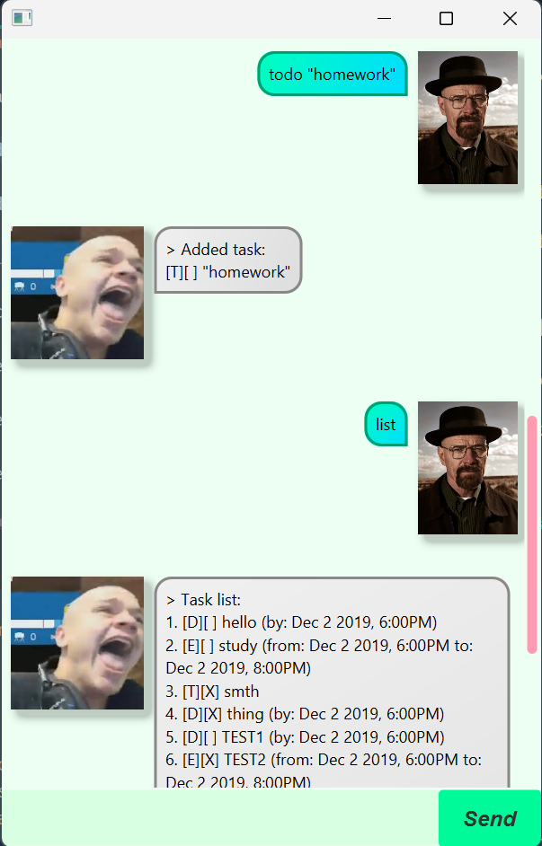

# Bernard User Guide



Bernard is a desktop chatbot app for managing tasks and personal reminders,
optimized for quick interactions via a Command Line Interface (CLI)
while still offering a simple Graphical User Interface (GUI).
If you can type fast, Bernard can help you organise your tasks and get reminders faster than
traditional GUI-only task apps.

## Adding todos: `todo`

Adds a todo task to the task list.

Format: `todo DESCRIPTION`

Example:`todo Read Book`

Example Output:
```
> Added task:
[T][ ] Read Book
```

## Adding deadlines: `deadline`

Adds a deadline task to the task list.

Format: `deadline DESCRIPTION /by DEADLINE_DUE`

Example: `deadline Return Book /by 2025-08-24 2000`

Example Output:
```
> Added task:
[D][ ] Return Book (by: Aug 24 2025, 8:00PM)
```

## Adding events: `events`

Adds an event task to the task list.

Format: `event DESCRIPTION /from EVENT_START /to EVENT_END`

Example: `event Project Meeting /from 2025-08-25 1400 /to 2025-08-25 1600`

Example Output:
```
> Added task:
[E][ ] Project Meeting (from: Aug 25 2025, 2:00PM to: Aug 25 2025, 4:00PM)
```


## Marking tasks as complete: `mark`

Mark a task as complete based on index in task list.

Format: `mark INDEX`

Example: `mark 1`

Example Output:
```
> I've marked the task as done!
[T][X] Read Book
```

## Marking tasks as incomplete: `unmark`

Mark a task as incomplete based on index in task list.

Format: `unmark INDEX`

Example: `unmark 1`

Example Output:
```
> I've marked the task as undone!
[T][ ] Read Book
```

## Deleting tasks: `delete`

Deletes a task from the task list by index.

Format: `delete INDEX`

Example: `delete 1`

Example Output:
```
> Removing task:
[T][ ] Read Book
I've deleted the task!
```

## Listing tasks: `list`

Format: `list`

Example: `list`

Example Output:
```
> Task list:
1. [T][ ] Read Book
```

## Searching tasks: `find`

Find task matching specific search terms.

SEARCH_TERM is a single string where keywords are delimeted by `|`.

Format: `find SEARCH_TERM`

Example: `find book`

Example Output:
```
> Matching Tasks:
1. [T][ ] Read Book
```

## Closing Bernard: `bye`

Closes the chatbot.

Format: `bye`

Example: `bye`

Expected Outcome: Chatbot window closes